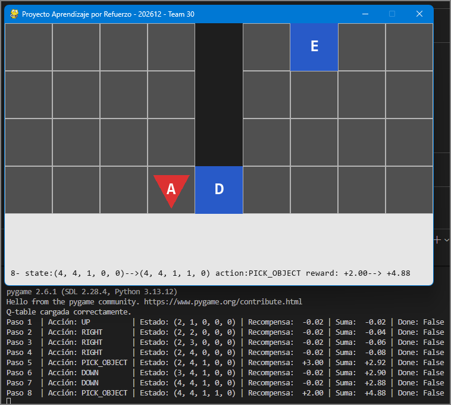

# Proyecto de Aprendizaje por Refuerzo 

**Equipo 30 | 202612 | Uniandes**

## Descripción General

Este es un proyecto educativo de **Aprendizaje por Refuerzo (RL)** que implementa un agente inteligente capaz de aprender a navegar un entorno 2D complejo. El agente debe resolver una secuencia de tareas: recoger una llave, recoger una bola, abrir una puerta y finalmente escapar por la salida.

El proyecto utiliza **Q-Learning** como algoritmo de aprendizaje y proporciona una interfaz visual en **Pygame** para observar el comportamiento del agente en tiempo real.

---

## Estructura del Proyecto

```
maia-proyecto-apr/
├── README.md                          # Este archivo
└── app_proyecto_apr/                  # Aplicación principal
   ├── agent.py                       # Implementación del agente Q-Learning
   ├── environment.py                 # Entorno RL (door-key-ball)
   ├── game.py                        # Interfaz visual con Pygame
   ├── train.py                       # Script de entrenamiento
   ├── run.py                         # Script para ejecutar el agente entrenado
   ├── q_table.csv                    # Q-table guardada (generada tras entrenamiento)
   └── __pycache__/                   # Cache de Python
```

---

## Componentes Principales

### 1. **Entorno (environment.py)**

Define el mundo donde el agente aprende y actúa.

#### Características:
- **Tablero**: Cuadrícula 4x9 con dos habitaciones separadas por paredes
- **Objetos**:
  - **Llave** (Key) - Debe recolectarse primero
  - **Bola** (Ball) - Debe recolectarse después de la llave
  - **Puerta** (Door) - Debe abrirse con la llave
  - **Salida** (Exit) - Objetivo final

#### Estado del Agente
Representado como una tupla: `S = (R, C, KP, BP, DO)`
- **R**: Fila del agente (1-4)
- **C**: Columna del agente (1-9)
- **KP**: ¿Tiene la llave? (0=No, 1=Sí)
- **BP**: ¿Tiene la bola? (0=No, 1=Sí)
- **DO**: ¿Está abierta la puerta? (0=No, 1=Sí)

#### Acciones Disponibles
1. `UP` - Mover hacia arriba
2. `DOWN` - Mover hacia abajo
3. `LEFT` - Mover hacia la izquierda
4. `RIGHT` - Mover hacia la derecha
5. `PICK_OBJECT` - Recoger un objeto cercano
6. `OPEN_DOOR` - Abrir la puerta (si tienes la llave)

#### Función de Recompensa
- **+15** - Alcanzar la salida (victoria)
- **+5** - Abrir la puerta
- **+3** - Recoger la llave
- **+2** - Recoger la bola
- **+1** - Cruzar a la habitación derecha
- **-3** - Intentar abrir puerta sin llave
- **-2** - Regresar a la puerta
- **-1** - Mover a la derecha de puerta cerrada
- **-0.02/-0.01** - Paso válido (costo de movimiento)
- **-0.1** - Movimiento inválido

---

### 2. **Agente Q-Learning (agent.py)**

Implementa el algoritmo Q-Learning para aprender la política óptima.

#### Parámetros
| Parámetro | Valor | Descripción |
|-----------|-------|-------------|
| `alpha (α)` | 0.1 | Tasa de aprendizaje |
| `gamma (γ)` | 0.95 | Factor de descuento |
| `epsilon (ε)` | 1.0 → 0.1 | Exploración/Explotación |
| `epsilon_decay` | 0.995 | Decaimiento por episodio |
| `max_steps` | 1000 | Máximo de pasos por episodio |

#### Métodos principales
- `choose_action(state)` - Selecciona acción (ε-greedy)
- `best_action(state)` - Retorna acción con mayor Q-value
- `update_values(state, action, reward, next_state)` - Actualiza Q-table
- `save_q_table()` / `load_q_table()` - Persistencia

---

### 3. **Interfaz Visual (game.py)**



Aplicación Pygame que permite visualizar al agente en acción.

#### Características Visuales
- **Tablero visual** con colores para cada elemento
- **Panel informativo** con 5 rectángulos que muestran:
  - **Paso**: Número de paso actual
  - **Estado**: Posición y objetos antes de la acción
  - **Nuevo**: Posición y objetos después de la acción
  - **Acción**: Acción tomada
  - **Recompensa**: Recompensa obtenida

#### Controles
- **SPACE** - Iniciar/pausar la simulación
- **ESC** - Salir

---

## Instalación

### Requisitos
- Python 3.8+
- pip o conda

### Dependencias
```bash
pip install pygame numpy pandas
```

### Configuración
```bash
cd app_proyecto_apr
```

---

## Uso

### 1. Entrenar el Agente
Ejecuta el script de entrenamiento para crear la Q-table:

```bash
cd app_proyecto_apr
python train.py
```

**Salida esperada:**
- Se entrena el agente durante N episodios
- Se imprime progreso: episodio, recompensa acumulada, épsilon
- Se genera `q_table.csv` con la tabla de valores Q

**Parámetros configurables en `train.py`:**
- `num_episodes` - Número de episodios
- `learning_rate` - Tasa de aprendizaje
- `discount_factor` - Factor de descuento

### 2. Ejecutar el Agente
Visualiza el agente usando la Q-table entrenada:

```bash
cd app_proyecto_apr
python game.py
```

**Instrucciones:**
1. Presiona **SPACE** para iniciar
2. El agente se moverá automáticamente
3. Presiona **SPACE** durante la ejecución para pausar/reanudar
4. Observa el panel inferior con los 5 rectángulos de información
5. Presiona **ESC** para salir

### 3. Analizar la Q-table
Inspecciona los valores Q aprendidos:

```bash
cd app_proyecto_apr
python analizar_q_table.py
```

---

## Cómo Funciona el Aprendizaje

### Algoritmo Q-Learning

Q-Learning es un algoritmo **off-policy** que aprende la función de valor óptima:

$$Q(s, a) \leftarrow Q(s, a) + \alpha \left[r + \gamma \max_a Q(s', a) - Q(s, a)\right]$$

Donde:
- **s** = estado actual
- **a** = acción
- **r** = recompensa inmediata
- **s'** = siguiente estado
- **α** = tasa de aprendizaje
- **γ** = factor de descuento

### Estrategia ε-Greedy

1. Con probabilidad **ε** (exploración): selecciona acción aleatoria
2. Con probabilidad **1-ε** (explotación): selecciona mejor acción conocida

El epsilon disminuye durante el entrenamiento: `ε ← ε × 0.995`

---

## Archivos clave que generas

Después de ejecutar `train.py`, se genera:

### `q_table.csv`
Tabla de valores Q para cada par (estado, acción). Formato:

```csv
STATE,UP,DOWN,RIGHT,LEFT,PICK_OBJECT,OPEN_DOOR
(1,1,0,0,0),-0.15,0.05,0.20,-0.05,0.00,0.00
(1,1,0,0,1),-0.12,0.08,0.25,0.02,0.10,0.00
...
```

---

## Ejemplo de Ejecución

```bash
# Terminal 1: Entrenar
$ python train.py
Episodio 1/1000 - Recompensa: 5.5 - Epsilon: 0.995
Episodio 2/1000 - Recompensa: 8.2 - Epsilon: 0.990
...
Episodio 1000/1000 - Recompensa: 15.0 - Epsilon: 0.100
Q-table guardada en q_table.csv

# Terminal 2: Ejecutar
$ python game.py
Q-table cargada correctamente.
Presiona SPACE para iniciar
[Abre ventana de Pygame]
```

---

## Troubleshooting

### ❌ "Q-table no cargada"
- Ejecuta primero `python train.py` para generar `q_table.csv`
- Verifica que `q_table.csv` esté en `app_proyecto_apr/`

### ❌ Error de Pygame
```bash
pip install --upgrade pygame
```

### ❌ Memoria insuficiente
- Reduce `num_episodes` en `train.py`
- El entorno es pequeño, así que debería funcionar en cualquier máquina

---

## Conceptos Educativos

Este proyecto enseña:

✅ **Fundamentos de RL**: Estados, acciones, recompensas  
✅ **Q-Learning**: Un algoritmo fundamental en aprendizaje por refuerzo  
✅ **Exploración vs. Explotación**: Estrategia ε-greedy  
✅ **Visualización de RL**: Cómo ver un agente aprender en tiempo real  
✅ **Resolución de problemas secuenciales**: Tareas multi-objetivo  

---

## Próximas Mejoras

- [ ] Aumentar complejidad del entorno
- [ ] Implementar Deep Q-Learning (DQN)
- [ ] Benchmarks de rendimiento
- [ ] Exportar trayectorias para análisis
- [ ] Soporte para múltiples agentes

---

## Autores
**Equipo 30 - 202612**  
Universidad de los Andes

---

## Licencia
Proyecto educativo - Código provisto como material de clase.
