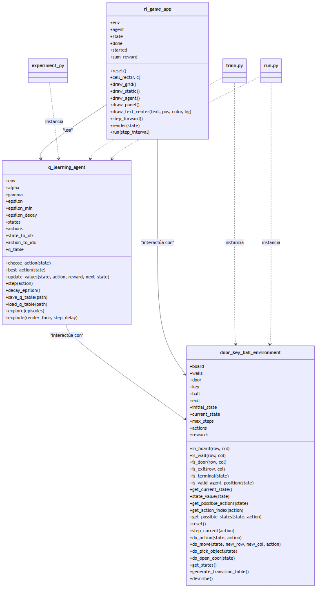
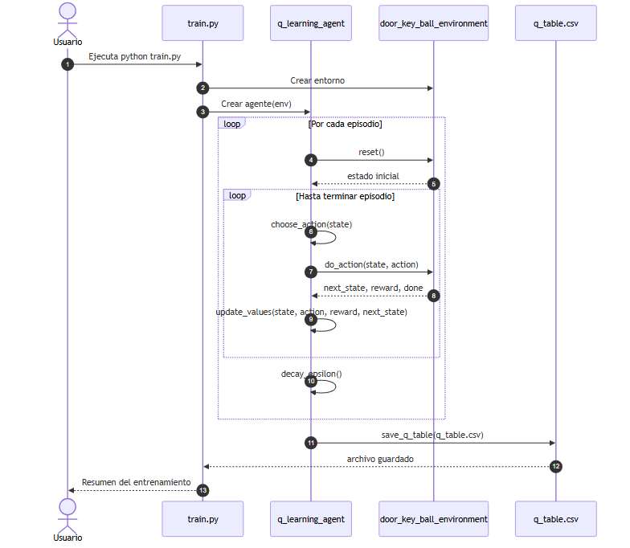
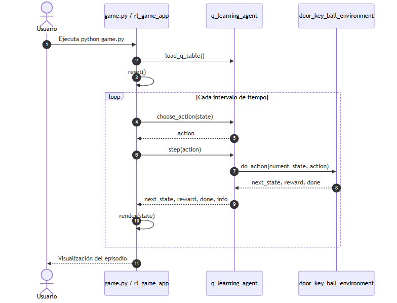
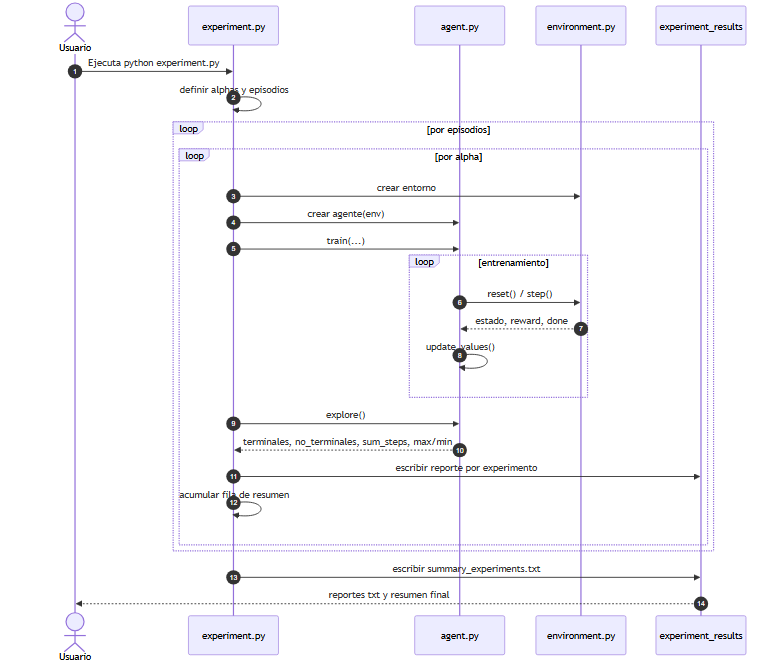

# Diagramas del proyecto

[README](../README.md) 

## Diagrama de clases

Figura: Diagrama de clases del entorno, el agente y la aplicación visual.

## Diagrama de secuencia de entrenamientos

Figura: Secuencia de entrenamiento del agente con Q-Learning.

## Flujo visual del agente

Figura: Secuencia de ejecución visual del agente en Pygame.

## Diagrama de secuencia de experimentos

Figura: Secuencia de ejecución de experimentos con variación de parámetros y generación de reportes.

---

[⬅ Volver al README](../README.md)
